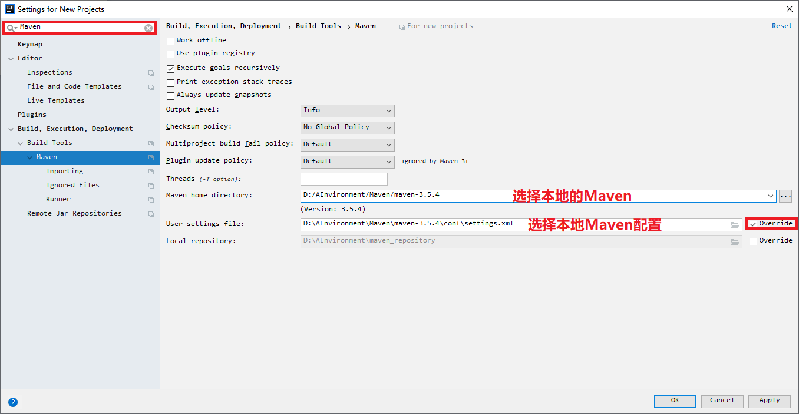
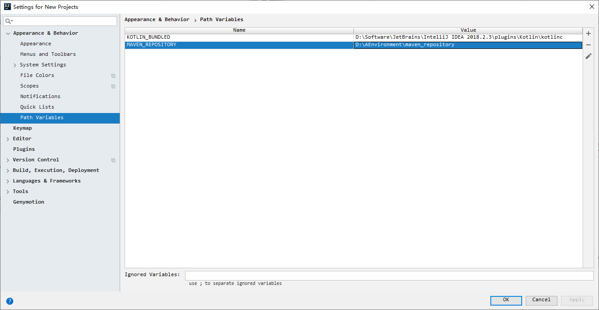
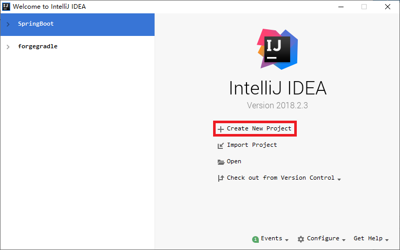
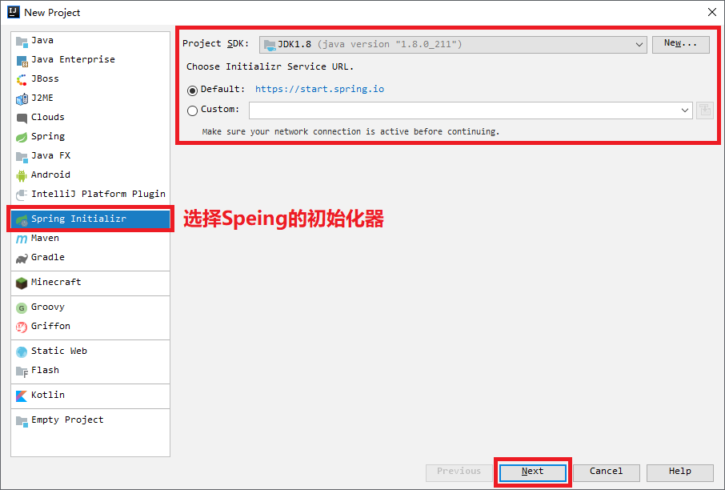
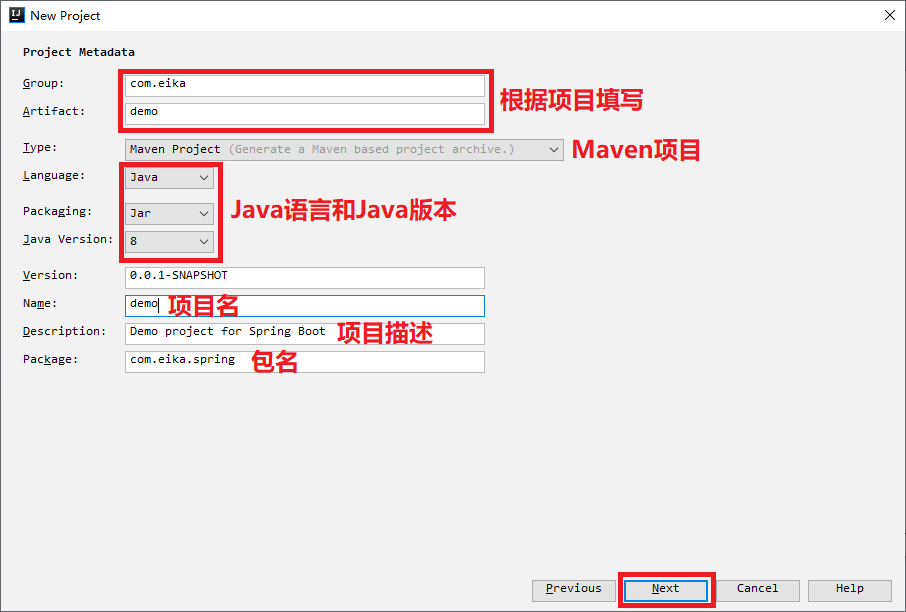
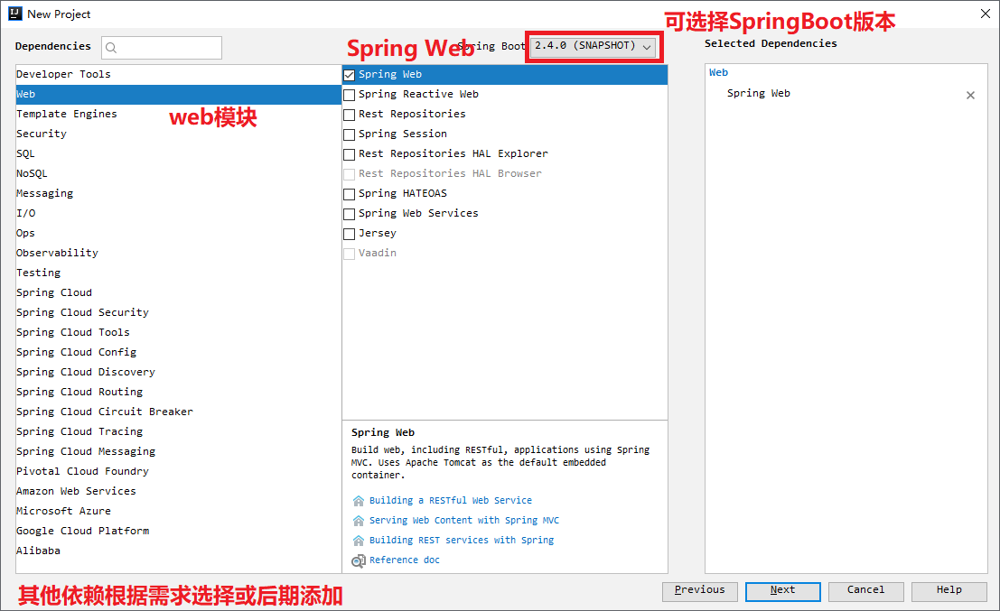
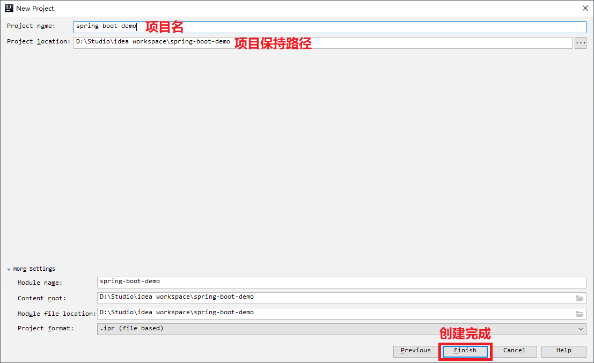

# 环境配置

## 一、Java 环境

### 1. 下载、安装和配置

- 【[下载JDK](https://www.oracle.com/java/technologies/javase/javase-jdk8-downloads.html)】【请选择对于的版本进行下载】，安装时保持默认配置。

- 添加环境变量

  ```txt
  # 注意路径，HOME变量一定时对于的根目录
  JAVA_HOME: C:\Program Files\Java\jdk1.8.0_211
  JRE_HOEM: C:\Program Files\Java\jre1.8.0_221
  
  # 保证 JAVA_HOME 正确后，CLASSPATH 照搬
  CLASSPATH: .;%JAVA_HOME%\lib\dt.jar;%JAVA_HOME%\lib\tools.jar;
  
  # 请不要直接覆盖path变量，应该在变量的最后加 ";" 后再添加新变量
  PATH: %JAVA_HOME%\bin;%JRE_HOME%\bin
  ```

- 测试：在 **命令提示符(cmd)** 里执行 **java -version** 可以查看  **Java** 版本，执行 javac 不报错即配置成功。

- **注：根目录指含有 bin 等子目录的路径。**


## 二、Maven 环境

### 1. 下载和配置

- [下载Maven](http://maven.apache.org/download.cgi)，选择bin版本，如[ apache-maven-3.6.3-bin.zip](https://mirrors.tuna.tsinghua.edu.cn/apache/maven/maven-3/3.6.3/binaries/apache-maven-3.6.3-bin.zip)，并解压，根据自己的喜好选择解压路径。

- 配置Maven环境变量：

  ```txt
  # 注意路径，HOME变量一定时对于的根目录
  MAVEN_HOME: D:\maven\apache-maven-3.6.3
  
  # 请不要直接覆盖path变量，应该在变量的最后加 ";" 后再添加新变量
  PATH: %MAVEN_HOME%\bin
  ```

- 测试Maven环境：**命令提示符(cmd)** 执行 **maven -version**，可以显示Maven本版即配置成功。

- **注：根目录指含有 bin 等子目录的路径。**


### 2. 修改本地仓库 和 添加远程仓库

- **编辑maven目录下\conf\seettings.xml**

  ```xml
  <settings xmlns="http://maven.apache.org/SETTINGS/1.0.0"
            xmlns:xsi="http://www.w3.org/2001/XMLSchema-instance"
            xsi:schemaLocation="http://maven.apache.org/SETTINGS/1.0.0 http://maven.apache.org/xsd/settings-1.0.0.xsd">
      
      <!-- 设置本地仓库路径 maven_repository -->
      <localRepository>自定仓库路径</localRepository>
      
      <mirrors>
          <!-- 添加阿里云中央仓库 -->
      	<mirror>
              <id>alimaven</id>
              <name>aliyun maven</name>
              <url>http://maven.aliyun.com/nexus/content/groups/public</url>
        		<mirrorOf>central</mirrorOf>
      	</mirror>
      </mirrors>
      
      <profiles>
          
          <!-- 修改JDK版本位JDK8 -->
          <profile>
              <id>JDK-1.8</id>
              <activation>
                  <activeByDefault>true</activeByDefault>
                  <jdk>1.8</jdk>
              </activation>
              <properties>
                  <maven.compiler.source>1.8</maven.compiler.source>
                  <maven.compiler.target>1.8</maven.compiler.target>
                  <maven.compiler.compilerVersion>1.8</maven.compiler.compilerVersion>
              </properties>
          </profile>
          
          <!-- 修改 Spring 插件下载仓库 -->
          <profile>
            <id>spring plugins</id>
            <activation>
              <jdk>spring plugins</jdk>
            </activation>
            <pluginRepositories>
              <pluginRepository>
                <id>spring plugins</id>
                <name>Spring plugins</name>
                <url>https://maven.aliyun.com/repository/spring-plugin</url>
                <layout>default</layout>
                <snapshotPolicy>always</snapshotPolicy>
              </pluginRepository>
            </pluginRepositories>
          </profile>
          
    </profiles>
      
  </settings>
  ```

  

## 三、MySQL 环境

### 1. [下载MySQL](https://downloads.mysql.com/archives/community/)

- **选择对于版本下载并解压，根据自己的喜好选择解压路径。**

### 2. 配置

- 环境变量配置

  ```txt
  # 注意路径，HOME变量一定时对于的根目录
  MYSQL_HOME: D:\mysql\mysql-5.7.30
  
  # 请不要直接覆盖path变量，应该在变量的最后加 ";" 后再添加新变量
  PATH: %MYSQL_HOME%\bin
  ```

- MySQL 的配置

  ```ini
  # 在解压根路径添加 my.ini 配置文件，并将以下内容拷贝进去
  [mysqld]
  # 设置3306端口
  port=3306
  # 设置mysql的安装目录
  basedir=D:\Software\MySQL\5.6.45
  # 设置mysql数据库的数据的存放目录
  datadir=D:\Software\MySQL\5.6.45\Data
  # 允许最大连接数
  max_connections=200
  # 允许连接失败的次数。
  max_connect_errors=10
  # 服务端使用的字符集默认为utf8mb4
  character-set-server=utf8mb4
  # 创建新表时将使用的默认存储引擎
  default-storage-engine=INNODB
  # 默认使用“mysql_native_password”插件认证
  #mysql_native_password
  default_authentication_plugin=mysql_native_password
  [mysql]
  # 设置mysql客户端默认字符集
  default-character-set=utf8mb4
  [client]
  # 设置mysql客户端连接服务端时默认使用的端口
  port=3306
  default-character-set=utf8mb4
  ```

### 3. 安装

- **安装、初始化、运行和连接，以下使用命令提示行进行操作。**

  ```shell
  # 安装
  >mysqld --install
  
  # 初始化
  >mysqld --initialize
  
  # 运行
  >net start mysql
  
  # 连接，默认密码 root
  >mysql -u root -p
  ```

### 4. 修改数据库密码

- **修改 my.ini 配置文件**

  ```ini
  [mysqld]
  # 取消权限设置
  skip-grant-tables
  ```

- **修改密码，以下使用命令提示行进行操作。**

  ```shell
  # 连接数据库
  >use mysql
  
  # 修改密码
  >update user set password=password('newpassword') where user='root'5. 常用命令
  ```

### 5. 常用指令

```shell
a. show tables或show tables from database_name; -- 显示当前数据库中所有表的名称。
b. show databases; -- 显示mysql中所有数据库的名称。
c. show columns from table_name from database_name; 或show columns from database_name.table_name; -- 显示表中列名称。
d. show grants for user_name; -- 显示一个用户的权限，显示结果类似于grant 命令。
e. show index from table_name; -- 显示表的索引。
f. show status; -- 显示一些系统特定资源的信息，例如，正在运行的线程数量。
g. show variables; -- 显示系统变量的名称和值。
h. show processlist; -- 显示系统中正在运行的所有进程，也就是当前正在执行的查询。大多数用户可以查看他们自己的进程，但是如果他们拥有process权限，就可以查看所有人的进程，包括密码。
i. show table status; -- 显示当前使用或者指定的database中的每个表的信息。信息包括表类型和表的最新更新时间。
j. show privileges; -- 显示服务器所支持的不同权限。
k. show create database database_name; -- 显示create database 语句是否能够创建指定的数据库。
l. show create table table_name; -- 显示create database 语句是否能够创建指定的数据库。
m. show engies; -- 显示安装以后可用的存储引擎和默认引擎。
n. show innodb status; -- 显示innoDB存储引擎的状态。
o. show logs; -- 显示BDB存储引擎的日志。
p. show warnings; -- 显示最后一个执行的语句所产生的错误、警告和通知。
q. show errors; -- 只显示最后一个执行语句所产生的错误。
r. show [storage] engines; --显示安装后的可用存储引擎和默认引擎。
```


## 四、IDEA

- **如果经济允许，请支持正版。**

### 1. 安装  和 激活

- 根据 **喜好** 和 [**激活文档**](.\ider\acyivate.docx) 选择IDEA版本，[**下载**](https://www.jetbrains.com/idea/download/other.html)并安装。
  - 安装路径可以根据自己喜好选择，其余保持默认即可。

### 2. 设置 Maven 环境

- 打开IDEA，选择**Configure**，**选择Settings**，打开 **IDEA** 的设置界面。


- 搜索 **Maven** 或者依次找到 Build, Execution, Deployment-->Build Tools-->Maven



- 检查Maven本地库的路径，搜索Path Variables，或者依次找到 Appearance & Behavior-->Path Variables




### 3. 创建 SpringBoot 项目









